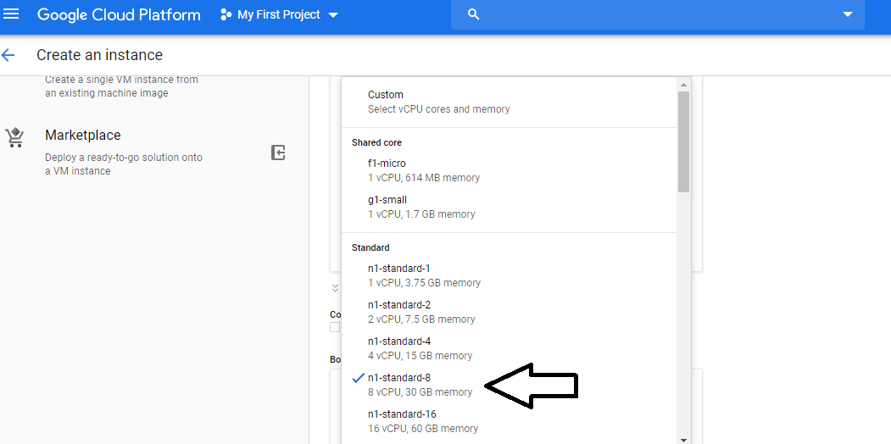
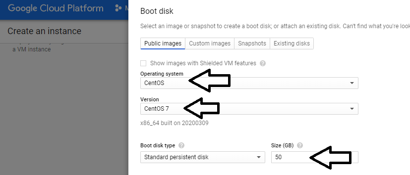

# OpenIAM Stack
This is how to run up an [OpenIAM](https://www.openiam.com/) stack in docker using docker-compose.

#### Note 
we are currently using the openiam [docker-compose](https://bitbucket.org/openiam/openiam-docker-compose/src/RELEASE-4.2.0.2/) version and not the [kubernetes](https://bitbucket.org/openiam/kubernetes-docker-configuration/src/) version as the k8s version does not start without errors at this time.  We will continue to evaluate their k8s repo to determine when to migrate to it. 
Also note that they mostly work on branches of code and don't really push back to master, so never install their master branch.

### OpenIAM document to follow
See this document for the prerequisites such as linking your docker hub account to OpenIAM to get access to the docker images. 
[OpenIAM instructions on how to run up in docker](http://docs.openiam.com/)

### Create a Google cloud instance as below
Use this guide for how to spec out our internal centos 7 VM.



### set the new root password first
```
sudo passwd
```

## Run the setup 
now run the steps here in the following order 
#### [setupMachine1.sh](setupMachine1.sh)
#### [setupMachine2.sh](setupMachine2.sh)
```
docker login 
# user and password is the user that is associated with OpenIAM and allowed to pull images from their repository
```
#### [setupMachine3.sh](setupMachine3.sh)

At the end of running the last command it will watch the docker serivces. Once all the services are healthy run this command and confirm a 200 response is returned.
```
curl -k -I -L http://127.0.0.1/idp/login.html
```

The log into the application with this user and password.
```
Username: sysadmin
Password: passwd00
```

## Post Setup follow this
[openami configure instructions](http://docs.openiam.com/docs419/html/docs.htm#Getting%20Started/Getting%20started%20with%20AWS.htm%3FTocPath%3DGetting%2520Started%7C_____2)

#### Running portainer to see your instances
if you are using gcp then open port 9000 to the firewall as shown above
```
docker volume create portainer_data
docker run -d -p 8000:8000 -p 9000:9000 --name=portainer --restart=always -v /var/run/docker.sock:/var/run/docker.sock -v portainer_data:/data portainer/portainer
```