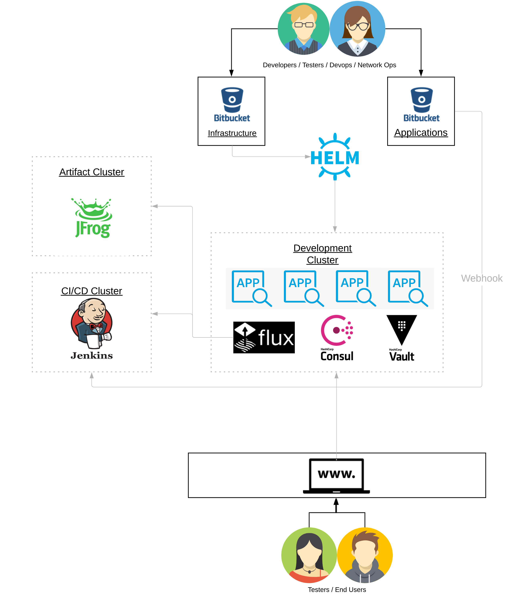

## Runbook - full setup
This runbook will walk through a full set up of all the clusters.

Our full set up will include 3 clusters
    
    - a JFrog image repository cluster to store docker images in.
    - a Jenkins cluster to build and deploy code in a CI/CD.
    - a Development cluster that will host a deployed version of the Stack.
    
JFrog and Jenkins will be created once and shared across Dev, Test and Prod clusters.    

## To install JFrog so that we have an image repository
follow the steps for setting up [JFrog](../infrastructure/jfrog/README.md).

## To install Jenkins so that we can have a CI/CD 
follow steps for setting up [Jenkins](../applications/jenkins/README.md).

## To install Standard Cluster so that we have a place to deploy applications such as AOL, XChange etc
follow steps for setting up [Standard Cluster](STANDARD_CLUSTER.md).