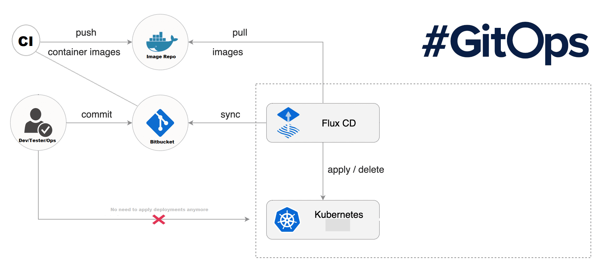
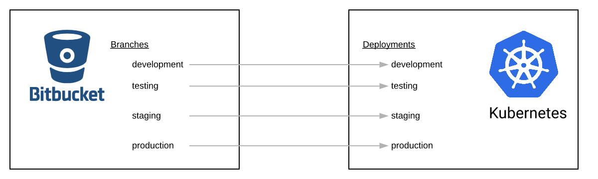
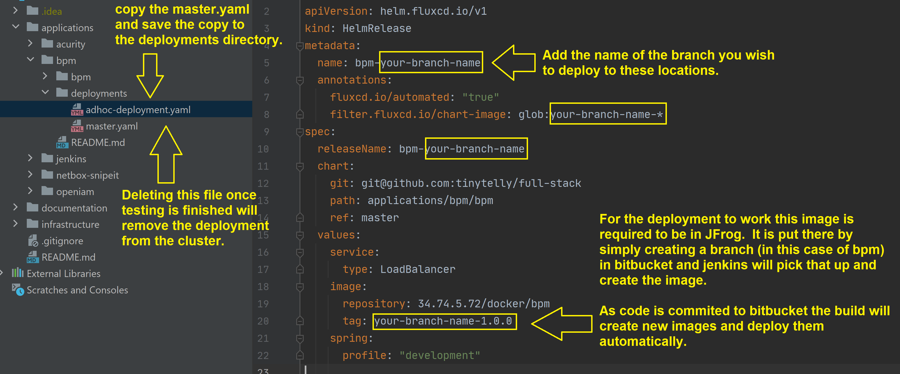

# GitOps
GitOps is a way to keep code and deployments in sync without actually having to run deployment jobs.
GitOps will listen for source code changes as well as docker image changes in an image repository.



GitOps provides a way to have a one to one mapping of branches to deployments.



### To install flux
We use [flux](https://fluxcd.io/) as our GitOps provider.
Following this [tutorial](https://github.com/fluxcd/helm-operator-get-started), the code below.

For information of each the charts properties see [fluxcd/flux](https://github.com/fluxcd/flux/tree/master/chart/flux/) and [fluxcd/helm-operator](https://github.com/fluxcd/helm-operator/tree/master/chart/helm-operator) charts.  
Information on the [kind: HelmRelease](https://docs.fluxcd.io/projects/helm-operator/en/latest/helmrelease-guide/introduction/) 

```
DOCKER_REGISTRY_URL=$IP

echo DOCKER_REGISTRY_URL = $DOCKER_REGISTRY_URL

helm repo update
helm repo add fluxcd https://charts.fluxcd.io
kubectl apply -f https://raw.githubusercontent.com/fluxcd/helm-operator/master/deploy/crds.yaml
kubectl create namespace flux

helm upgrade -i flux fluxcd/flux \
--set git.url=git@github.com:tinytelly/full-stack \
--set registry.automationInterval=1m \
--set registry.insecureHosts=$DOCKER_REGISTRY_URL \
--set git.pollInterval=1m \
--set syncGarbageCollection.enabled=true \
--set git.path="applications/acurity/aol/deployments\,applications/bpm/deployments" \
--namespace flux

helm upgrade -i helm-operator fluxcd/helm-operator \
--set git.ssh.secretName=flux-git-deploy \
--set git.pollInterval=1m \
--set chartsSyncInterval=1m \
--namespace flux \
--set helm.versions=v3

watch kubectl -n flux get pods

```

#### Set up any application config maps
Once you link you git repository to your cluster to auto deploy via flux you may need to install any config maps that are part of your stack on the cluster.
See [AOL](../../applications/acurity/aol/README.md) for any client specific config maps.

#### Create a deployment for a branch of code
As a developer works on code they can have that code deployed to the cluster by following these steps.



#### To get the key to add to a github repo
You need to put the Deploy Key in the bitbucket or github repo that you wish to monitor.
See the guide to adding keys for [github](https://docs.github.com/en/developers/overview/managing-deploy-keys#deploy-keys) or [bitbucket](https://blog.stapps.io/bitbucket-deploy-access-keys/).
To get the key run the following.
```
kubectl -n flux logs deployment/flux | grep identity.pub | cut -d '"' -f2
```

#### Optional to speed up polling of the helm chart
this config is found in the helm chart for [helm-operator](https://github.com/fluxcd/helm-operator/tree/master/chart/helm-operator) with extra [faq](https://github.com/fluxcd/helm-operator/blob/master/docs/faq.md)
```
default is 5m
--set git.pollInterval=1m
--set chartsSyncInterval=1m
```

#### Optional to speed up polling image registry
this config is found in the helm chart for [flux](https://github.com/fluxcd/flux/tree/master/chart/flux)
```
default is 5m
--set registry.automationInterval=1m
--set git.pollInterval=1m
```

#### To tail fluxcd logs
```
# All logs
kubectl -n flux logs deployment/flux -f

# Watch for docker images changes
kubectl -n flux logs deployment/flux -f | grep 'added update to automation run'
```

#### To uninstall flux
```
helm --namespace flux uninstall flux
helm --namespace flux uninstall helm-operator 
```